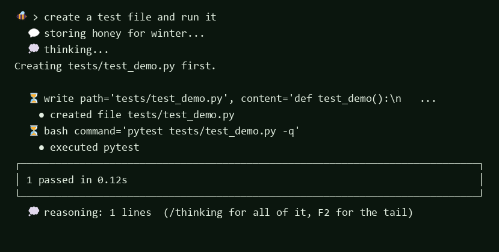
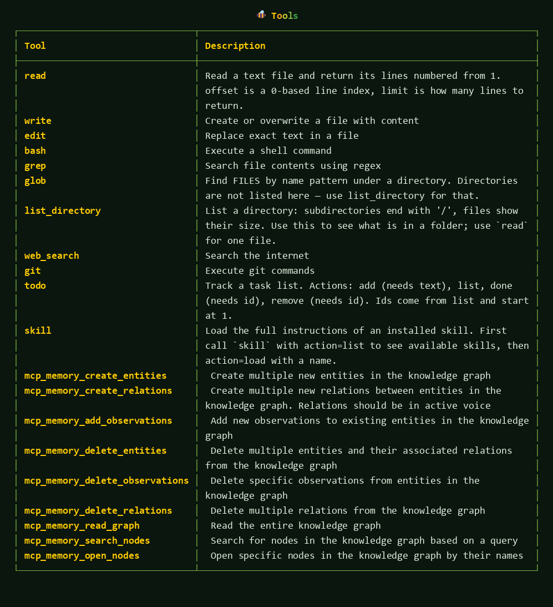
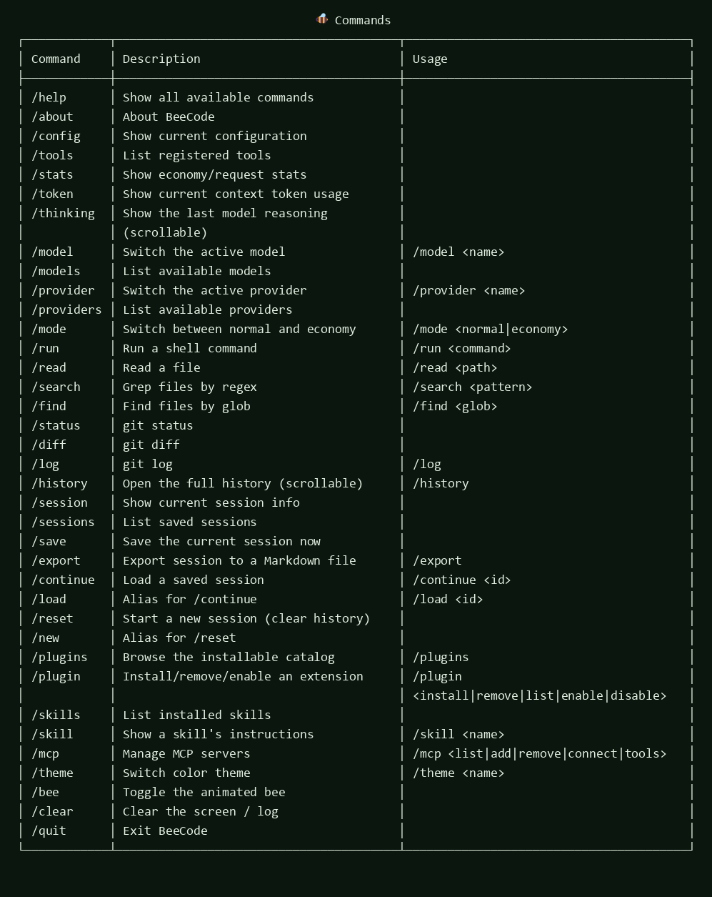

<p align="center">
  
</p>

<p align="center">
  <a href="https://t.me/beecodee"></a>
  <a href="https://github.com/egorVasile/beecode/blob/main/LICENSE"></a>
</p>

# BeeCode

**A free AI coding agent for your terminal.** No API key, no account, no subscription —
it talks to public model endpoints through [g4f](https://github.com/xtekky/gpt4free)
and edits your real files, runs your real commands.

Type a task in plain language; BeeCode reads the project, writes code, runs tests,
shows every step, and keeps working until the task is done.

```
🐝 > fix the failing tests in ./api and show me what you changed
   💬 storing honey for winter...
   💭 thinking...
   ⏳ glob path='api', pattern='**/*.py'
     found files 12 files
   ⏳ read path='api/test_client.py'
     read api/test_client.py
   ⏳ bash command='pytest api -q'
     executed pytest
     3 passed in 1.42s
   ✅ done — changed api/client.py: retry on timeout, see diff above
```

<p align="center">
  
</p>

---

## Install

BeeCode is a Python program, and the launcher below is the npm wrapper around
it — one command either way, and it needs Python 3.10+ on the machine.

**With npm / npx** (nothing to install first; it builds its own private
environment under `~/.beecode`, so your system Python stays untouched):

```bat
npx github:egorVasile/beecode
```

Or put `beecode` on your PATH once:

```bat
npm install -g github:egorVasile/beecode
cd C:\path\to\your\project
beecode
```

The first run installs BeeCode and a fresh `g4f`; every later run starts in
about two seconds. `beecode --update` refreshes both, and it means the same
thing from any install path: a checkout is pulled, an installed copy is
reinstalled from the repository.

```bat
beecode --update
```

**With pip**, into whatever Python environment you already use:

```bat
pip install git+https://github.com/egorVasile/beecode.git
```

Then start it from the project you want to work on:

```bat
cd C:\path\to\your\project
beecode
```

Every install path above starts **clean**: sessions and settings live in the
folder you run it from (`.beeagent/` and `beeagent.json`), so a new folder is a
new agent with no history. Nothing is resumed unless you ask for it with
`beecode --continue`.

<details>
<summary>Other install options</summary>

```bat
:: clone and install in editable mode (for hacking on the agent itself)
git clone https://github.com/egorVasile/beecode.git
cd beecode
pip install -e .

:: or run without installing
python -m beeagent.cli
```

</details>

## Run

| Command | What it does |
| --- | --- |
| `beecode` | Interactive REPL (the default interface) |
| `beecode --model command-a-03-2025` | Start with a specific model |
| `beecode --provider g4f` | Start with a specific provider |
| `beecode --mode economy` | Cache answers and reuse them across identical requests |
| `beecode --lang ru` | Russian interface (default is English) |
| `beecode --continue` | Resume the last saved session |
| `beecode --tui` | Full-screen Textual interface instead of the REPL |
| `beecode -p "explain this repo"` | One-shot: ask, print the answer, exit |
| `beecode models` | List every model the installed g4f can reach |
| `beecode providers` | List configured providers |
| `beecode plugins list` | Browse the installable skill / plugin / MCP catalog |
| `beecode mcp list` | Show configured MCP servers |

First question to try: `read README.md and tell me what this project does`.

## What it looks like

<p align="center">
  
  
</p>

## How it works

BeeCode runs a plain, inspectable loop — no hidden orchestration:

1. **Build context.** System prompt + tool catalog (generated from the live registry,
   so the model can never be told about a tool that does not exist) + conversation
   history trimmed to the token budget.
2. **Stream the answer.** Tokens are printed as they arrive. Reasoning blocks, when a
   model exposes them, stream under a `💭 thinking...` header.
3. **Parse tool calls.** The model replies with a JSON block:
   ````json
   {"tool": "read", "args": {"path": "src/app.py"}}
   ````
   Prose around it stays on screen; the payload itself never flashes as text.
4. **Execute.** Tools run in a worker thread, so the prompt stays alive — you can keep
   typing while the agent works, and those messages are queued and delivered with the
   next model call.
5. **Feed back.** Each result returns to the model as a `[tool result]` message and the
   loop repeats until the model answers in plain text.

### Context window

A model with a small window used to lose the thread for one turn and then "remember" it
after you repeated yourself. Two causes, both fixed:

* **The budget follows the model, not a constant.** A request is built to fit the
  model's own context window minus room for its reply — 8k for a `llama-3.1-8b`,
  12k for a `gpt-4o` — instead of a flat 12 000 tokens that a small endpoint then
  trimmed on its own side, silently cutting the oldest history.
* **Tokens are counted, not guessed.** `gpt-4`-style names aside, every g4f model id
  fell back to "four characters per token", which read Russian text as half its real
  size — so an oversized request looked like it fit.

When the conversation still does not fit, nothing is thrown away in silence:

* oversized messages are **clipped** (head + tail kept, the cut marked in tokens);
* the request you are working on is **shrunk rather than dropped** — it always travels;
* everything else is **compressed into a digest that rides in the system prompt**, so
  the model sees the shape of the chat instead of a blank page:

```
# CONVERSATION SO FAR — 42 earlier message(s) were compressed to fit the context window.
user: разбери проект и найди все проблемы в beeagent/core
bee: пункт 0: подробное обоснование найденной проблемы…
tool: → read
user: а теперь почини их и прогони pytest
```

You see it happen, and `/token` shows the window it was fitted to:

```
✂ history did not fit the context: compressed 42 messages into a summary in the system prompt, big outputs are clipped — the task stays in view
```

### Mistakes are recovered, not fatal

* `list_files`, `read_directory`, `read_files` — invented names for `list_directory`,
  accepted as aliases: `🔧 tool name corrected: read_directory → list_directory`
* Near-miss typos (`reaid` → `read`) are repaired; anything else is refused with the
  real tool list handed back to the model, so it corrects itself.
* Missing arguments are reported to the model as `grep needs path; its parameters are:
  pattern, path, include` instead of crashing.
* Windows paths written with single backslashes inside JSON are repaired before parsing.

## Tools

The model can use these (type `/tools` to see the live list, including tools added by
plugins and MCP servers):

| Tool | Purpose |
| --- | --- |
| `read` | Read a file, lines numbered; `offset`/`limit` for long files |
| `write` | Create or overwrite a file |
| `edit` | Replace exact text in a file |
| `bash` | Run a shell command (Git Bash on Windows, so `&&`, `~`, `mkdir -p` work) |
| `list_directory` | List a folder: directories end with `/`, files show size |
| `glob` | Find files by name pattern |
| `grep` | Search file contents with a regex |
| `git` | Run git (`status`, `diff`, `log`, `commit`…) |
| `web_search` | Search the web |
| `todo` | Keep a task list while working |
| `skill` | Load the full instructions of an installed skill |

## Providers and models

BeeCode ships with one working provider — **g4f**, keyless — and can use any
free-tier endpoint that speaks the OpenAI API once **you** add your own key.

```
/providers            what can serve requests right now, and what still needs a key
/key groq <token>     store a key you obtained yourself (saved to beeagent.json, never echoed)
/provider groq        switch; the model list and the default model follow the provider
/models               recommended first: widest context, then the rest of the catalog
/models --all         every model g4f knows about (600+), still biggest window first
/models Cloudflare    filter by name or by g4f upstream
/model command-a-03-2025  pick one
```

Each row carries a window: `✔ 32k` was measured on this machine by the endpoint
refusing or forgetting a prompt, `~ 1M` is what the model id claims. Measured wide
models lead the list; a model measured at 2k sits at the bottom whatever its name
says, because the claim describes a name and the measurement describes your route.

### What answers without a key

"Free" upstreams move constantly, so this is measured rather than believed — and
the numbers below were taken on g4f 8.5.7 on 2026-09-21 by sending prompts whose
first line holds a random code the model has to repeat back:

| Route | Keyless | Result of the measurement |
| --- | --- | --- |
| `command-a-03-2025` (Cohere ForAI) | no | read the code back from **65536 tokens, twice**, ~2 s a step |
| `LLM7` (model id `default`) | no | read 65536 once, then answered round two with `429 rate_limit_exceeded` |
| `gpt-4` (Yqcloud) | no | **measured 2048** — refused 4k with 文字过长, "text too long" |
| `search` (GoogleSearch) | no | took 32768 without complaining, recall not verified |
| Cloudflare | no | went silent on a 2048-token prompt for 90 s |
| `glm-4.7-flash`, `deepseek-chat`, `gemini-2.5-flash` | no | fine at 2048; at 4096 the free path returns 401, a key request, or goes quiet for minutes |
| OpenRouterFree, Nvidia, Pollinations, GeminiPro, G4FSpace, RelayRouter, OrcaRouter | no | hidden behind g4f's own broker, which demands proof-of-work "cake credits" (402) |
| DeepInfra, Copilot, Cerebras, HuggingChat, Airforce, KiloCode, OpenCode, MetaAI, OperaAria, DeepSeek | no | Turnstile token, a live Chrome over CDP, your browser cookies, an account, or a plain 401 |

That is why `command-a-03-2025` is the default model: it is the one keyless route
measured to hold a real working session, and the same file-reading turn through it
took 5.0 s against 35.1 s on the `gpt-4` route. Run `/window measure <model>` in
your own session to see what *your* route carries today — the answer is cached per
model and wins over any name-based guess.

`/providers` lists the built-in free-tier endpoints with the page where each key is issued:

| Provider | Where the free key comes from | What the free tier gives |
| --- | --- | --- |
| `g4f` | no key at all | public endpoints routed by g4f, ~630 models |
| `openrouter` | openrouter.ai/settings/keys | a shelf of `:free` models, no card |
| `groq` | console.groq.com/keys | very fast llama/qwen, generous free quota |
| `gemini` | aistudio.google.com/apikey | flash/mini models free per minute |
| `huggingface` | huggingface.co/settings/tokens | free inference credits |
| `github` | github.com/settings/tokens | gpt-4o/llama endpoints for your own account |
| `cerebras` | cloud.cerebras.ai | qwen/llama at high speed, free tier |
| `mistral` | console.mistral.ai | experiment tier, rate limited |
| `nvidia` | build.nvidia.com | free credits without a card, wide open-model catalog |
| `deepinfra` | deepinfra.com | trial credits on signup, pay-per-token after |
| `together` | api.together.xyz/settings/api-keys | one-time credit, some open models free |

Keys are read from `beeagent.json` (`api_keys`) or the matching environment
variable, and `beeagent.json` is gitignored — the repository ships
`beeagent.example.json` instead. **Only your own keys**: BeeCode does not ship,
harvest or share other people's credentials, and using leaked ones gets the key,
the account and often the user's IP banned.

### Is a model actually working?

Free endpoints come and go, so ask the code instead of a README:

```bat
python scripts\probe_models.py            :: the curated picks
python scripts\probe_models.py --all      :: every model g4f advertises
```

Each model gets one tiny request; the script prints `✅`/`❌`, latency and the
reply, and `--json` writes the raw results.

Last full run: **620 of 645** g4f models obeyed a one-word instruction
(median 12.7 s) — [docs/MODELS.md](docs/MODELS.md) has the breakdown, including
which single upstream carries half the catalog.

### How big is the context window, really?

g4f does not publish window sizes — its `Model` carries a name and providers, and
provider classes keep `max_tokens = None` — so BeeCode **measures** them. Two
signals come off the endpoint: how large a prompt it refuses, and how large a
prompt the model still *saw*.

```
/window                      what BeeCode believes about the current model, and why
/window measure gpt-4o-mini  ask the endpoint (a few minutes of real requests)
```

```bat
python scripts\probe_window.py glm-4.7-flash --ceiling 32768
python scripts\probe_window.py --all-candidates
```

The second signal is the one that matters on free endpoints. They often do not
refuse an oversized prompt — they trim it and answer as if the conversation had
just started, which no error would ever reveal. So each probe request buries a
random code at the very start of the filler and asks for it back: a size the
model cannot repeat is a size it did not receive, and the window stops at the
last size it genuinely read. An endpoint that fumbles the trick at the smallest
prompt is dim rather than dishonest, and the measurement falls back to refusals.

Measurements are cached in `.beeagent/windows.json` (never committed) and then win
over the guess taken from the model name, so the request ceiling follows the model
you actually picked. A refusal that names its limit (`maximum context length is
8192 tokens`) is used as stated; a refusal that only says "too long" still narrows
the window to the largest prompt that fitted. A rate limit, a revoked key or a
prompt that simply took too long says nothing about size, so the probe stops and
reports it instead of caching the last number it happened to send — a sick or slow
endpoint is not a small one.

## Slash commands

Type `/` in the REPL and the menu filters as you type; `Tab` completes, arguments
(models, providers, sessions, catalog entries) complete too, and list commands open a
mouse-clickable picker.

<!-- generated from beeagent/ui/commands.py by scripts/sync_readme.py -->
<!-- COMMANDS:BEGIN -->
| Command | What it does | Usage |
| --- | --- | --- |

### Model, Provider, Mode

| Command | What it does | Usage |
| --- | --- | --- |
| `/allow` | Grant one unsafe tool for this session | `/allow <tool>` |
| `/extensions` | What the installed plugins added | `/extensions` |
| `/key` | Store your own API key for a provider | `/key <provider> <token>` |
| `/lang` | Switch the interface language | `/lang <en|ru>` |
| `/mode` | Switch between normal and economy | `/mode <normal|economy>` |
| `/model` | Switch the active model | `/model <name>` |
| `/models` | List models with the widest context first, --all for every one | `/models [name|upstream] [--all]` |
| `/permissions` | Who may touch the machine: ask, auto or readonly | `/permissions <ask|auto|readonly>` |
| `/provider` | Switch the active provider | `/provider <name>` |
| `/providers` | List providers and which ones have a key | `/providers` |
| `/skin` | Choose interface variants: frames, banner, spinner | `/skin [slot] [variant]` |

### Skills, Plugins, Mcp

| Command | What it does | Usage |
| --- | --- | --- |
| `/mcp` | Manage MCP servers | `/mcp <list|add|remove|connect|tools>` |
| `/plugin` | Install/remove/enable an extension | `/plugin <install|remove|list|enable|disable> [name]` |
| `/plugins` | Browse the installable catalog | `/plugins [filter]` |
| `/skill` | Show a skill's instructions | `/skill <name>` |
| `/skills` | List installed skills | `/skills` |

### Git

| Command | What it does | Usage |
| --- | --- | --- |
| `/diff` | git diff | `/diff` |
| `/log` | git log | `/log [n]` |
| `/status` | git status | `/status` |

### Info And Status

| Command | What it does | Usage |
| --- | --- | --- |
| `/about` | About BeeCode | `/about` |
| `/config` | Show current configuration | `/config` |
| `/help` | Show all available commands | `/help` |
| `/pool` | Address, seat and budget of a key pool | `/pool [url <адрес> | enroll | status]` |
| `/stats` | Show economy/request stats | `/stats` |
| `/thinking` | Show the last model reasoning (scrollable) | `/thinking` |
| `/token` | Show current context token usage | `/token` |
| `/tools` | List registered tools | `/tools` |
| `/update` | Check for a newer BeeCode and install it | `/update` |
| `/window` | Show or measure the model context window | `/window [measure] [model]` |

### Sessions

| Command | What it does | Usage |
| --- | --- | --- |
| `/continue` | Load a saved session | `/continue <id>` |
| `/export` | Export session to a Markdown file | `/export [path]` |
| `/history` | Open the full history (scrollable) | `/history [list]` |
| `/load` | Alias for /continue | `/load <id>` |
| `/new` | Alias for /reset | `/new` |
| `/reset` | Start a new session (clear history) | `/reset` |
| `/save` | Save the current session now | `/save` |
| `/session` | Show current session info | `/session` |
| `/sessions` | List saved sessions | `/sessions` |

### Run Tools Directly

| Command | What it does | Usage |
| --- | --- | --- |
| `/find` | Find files by glob | `/find <glob> [path]` |
| `/read` | Read a file | `/read <path>` |
| `/run` | Run a shell command | `/run <command>` |
| `/search` | Grep files by regex | `/search <pattern> [path]` |

### Ui

| Command | What it does | Usage |
| --- | --- | --- |
| `/bee` | Toggle the animated bee | `/bee` |
| `/clear` | Clear the screen / log | `/clear` |
| `/quit` | Exit BeeCode | `/quit` |
| `/theme` | Switch color theme | `/theme <name>` |
<!-- COMMANDS:END -->

## Skills, plugins and MCP servers

BeeCode has one extension mechanism with three kinds, browsed from a bundled catalog:

* **skills** — markdown instruction packs the model can load on demand (`/skills`, `/skill <name>`);
* **plugin packs** — Python packages that register extra tools (`/plugin install <name>`);
* **MCP servers** — external tools over the Model Context Protocol (`/mcp add`, `/mcp connect`).

```
/plugins                    catalog in a mouse-pickable list
/plugin install code-review install from the catalog (or a git URL)
/plugin list                what is installed, and what is switched off
/mcp add memory npx -y @modelcontextprotocol/server-memory
/mcp connect memory         start it and cache its tool schemas
```

First-time MCP discovery can take a minute (npm downloads), so it never runs at startup:
startup loads cached schemas only, and `/mcp connect` does the rest explicitly.

## Making BeeCode your own

Two knobs, both reachable without reading the source.

**Interface slots.** Every panel asks the skin how to be framed, so the decoration
is one setting, not a fork:

```
/skin                       slots, what is on now, and what you can pick
/skin frame none            take the borders away (rounded · heavy · square · ascii)
/skin banner none           no animated logo (shimmer · static · none)
/skin spinner dots          quiet waiting line instead of "wiping honey off the keyboard…"
/skin reset                 back to defaults
```

The choice is saved to `beeagent.json` under `ui`, so it survives a restart.

**The plugin API.** A plugin directory with a `setup(api)` function can add
capabilities and never has to import the REPL or patch a module:

```python
# .beeagent/plugins/word-count/plugin.py
from beeagent.tools.base import BaseTool, ToolResult

class WordCountTool(BaseTool):
    name = "word_count"
    description = "Count words and lines in a file."
    parameters = {"type": "object", "properties": {"path": {"type": "string"}}}

    def execute(self, path: str = "") -> ToolResult:
        text = open(path, encoding="utf-8").read()
        return ToolResult(output=f"{len(text.split())} words", error=False)

TOOLS = [WordCountTool()]                    # a tool for the model

def setup(api):
    api.setting("echo", True, "note after every answer")        # its own setting
    api.command("wc", "Count words", my_handler, usage="/wc <path>")
    api.event("done", lambda event, data: print(len(data["text"].split())))
    api.skin("frame", "plain", {"box": my_space_box})           # an interface variant
```

`/extensions` lists what every plugin added and who added it. A plugin may **add**,
never **replace**: a command or tool whose name is taken is refused rather than
quietly winning — an extension that could take over `bash` would inherit the
permission you gave the real one, and a plugin that crashes shows a note instead of
killing the REPL.

**Shipped skins.** Four plugins exist purely to prove the slots, and each is a
working example of a different kind of extension:

| plugin | what it changes |
| --- | --- |
| `plain` | frameless panels, static logo, quiet waiting line |
| `skin-work` | thinnest possible: no logo at all, no phrases, minimal borders |
| `skin-hive` | its own frame colour, a hex-comb opening, buzzing waiting lines |
| `skin-terminal` | ASCII borders, a one-line header, and **its own answer renderer** |

The last one is the interesting case: a slot can hold a *callable* (banner,
spinner) or a *class* (stream), so a plugin can decide how the model's answer
appears on screen, not just what colour its border is. `/skin stream default`
puts the built-in renderer back.

Also in the catalog: `word-count` — tool + command + setting + event listener in
one file.

## A key pool

If you (or someone you trust) runs a BeeCode pool — a small proxy that holds API
keys and answers instead of handing them out — BeeCode talks to it as a provider:

```
/pool url https://your-host:8077
/pool enroll
/provider pool
/pool status
```

`/pool enroll` asks the pool for a seat and stores its token in `beeagent.json`;
the address and the seat are the only things this client ever learns, and neither
is a key. The pool decides which account serves a model, so `/provider pool` works
with the model names you already use. Errors come back as what they are — no seat
yet, seat awaiting approval, today's budget spent, every key rate-limited — with
the retry wait attached.

## Configuration

`beeagent.json` in the working directory (see `beeagent.example.json`):

| Field | Default | Meaning |
| --- | --- | --- |
| `model` | `command-a-03-2025` | Model id passed to the provider |
| `provider` | `g4f` | Which registered provider to use |
| `mode` | `normal` | `economy` enables answer caching |
| `max_turns` | `50` | Tool-loop iterations per request |
| `max_context_tokens` | `0` | Ceiling for one request; `0` takes the window from the model |
| `language` | `en` | Interface language, `en` or `ru` |
| `custom_providers` | `[]` | `openai_compat` / `ollama` endpoints |
| `api_keys` | `{}` | Your own keys per provider, added with `/key` (never printed in full) |
| `permissions.mode` | `ask` | `ask` · `auto` · `readonly` — see [Permissions](#permissions) |
| `permissions.allowed` | `[]` | Tools pre-approved for every session, e.g. `["bash", "write"]` |
| `ui` | `{}` | Interface slots: `frame`, `banner`, `spinner`, `stream` — see `/skin` |
| `extensions` | `{}` | Settings owned by plugins, keyed by plugin name |
| `economy.cache_enabled` | `true` | Turn answer caching off even in economy mode |
| `economy.cache_dir` | `.beeagent/cache` | Where answers and sessions live |
| `economy.cache_ttl_minutes` | `30` | How long a cached answer may stand before it is re-asked |

`BEECODE_LANG=ru` and `BEECODE_NO_ANIM=1` are also honoured.

## Permissions

BeeCode edits real files and runs real commands, so **the model does not decide
what is allowed — you do.** A reply from a free endpoint is a guess; guessing
`rm -rf` should not be enough to run it.

| Mode | What runs without asking | Switch |
| --- | --- | --- |
| `ask` (default) | Reading tools: `read`, `grep`, `glob`, `list_directory`, `web_search`, `todo`, `skill` | `/permissions ask` |
| `auto` | Everything | `/permissions auto` |
| `readonly` | Only the reading tools, even tools you granted | `/permissions readonly` |

In `ask` mode a tool that changes the machine — `write`, `edit`, `bash`, `git`,
and anything a plugin or MCP server adds — is refused, and you see why:

```
⛔ bash command='pytest -q'  blocked — no permission
   allow it: /allow bash   or /permissions auto to trust the model
```

`/allow <tool>` grants one tool for the session (`/allow remove <tool>` takes it
back), and the model is told the rules too, so it asks you instead of retrying.
Put names in `permissions.allowed` in `beeagent.json` to keep a grant forever.

The same rule covers extensions: `/plugin install <git-url>` clones code that
later runs inside BeeCode, so it needs `--trust` — after you have read it.

The economy cache keeps only final plain-text answers, never a half-finished
tool step, and expires entries after `cache_ttl_minutes` because a reply about
a file stops being true when the file changes.

## Language

The interface is English by default. `/lang ru` (or `--lang ru`, or `BEECODE_LANG=ru`)
switches every message, table and status line to Russian at runtime and saves the
choice to `beeagent.json`. Both languages live side by side in the source —
`L("english", "русский")` — so a new string cannot ship in one language only.

## Development

```bat
git clone https://github.com/egorVasile/beecode.git
cd beecode
pip install -e .
python -m pytest tests\ -q        200+ tests
python scripts\make_screenshots.py   regenerate the images above
```

Layout: `beeagent/core` (loop, context, parser, session), `beeagent/tools` (the tool
registry), `beeagent/providers` (g4f and custom endpoints), `beeagent/plugins`
(catalog, installer, MCP client), `beeagent/ui` (REPL, streaming renderer, commands,
scroll viewer), `tests/`.

## What we borrowed

BeeCode stands on other people's work, deliberately and by name:

* **[g4f](https://github.com/xtekky/gpt4free)** — free access to public model endpoints.
  Without it "no API key" would be a marketing phrase.
* **[Model Context Protocol](https://modelcontextprotocol.io)** — the JSON-RPC-over-stdio
  tool protocol implemented in `beeagent/plugins/mcp.py`.
* **DeepSeek Harness** — the idea that skills, plugins and MCP servers are one catalog
  with one installer, borrowed from its plugin model.
* **[rich](https://github.com/Textualize/rich)** and **[prompt_toolkit](https://github.com/Textualize/python-prompt-toolkit)** —
  terminal rendering and input; both by the Textualize team.
* The agent-loop shape (system prompt → tool call → `[tool result]` → repeat) is the
  pattern popularised by Claude Code, Aider and OpenHands.

## License

GNU General Public License v3.0 — see [LICENSE](LICENSE).

BeeCode was written in a terminal, with an AI agent, on Windows. It is a young project:
expect rough edges, and please [open an issue](https://github.com/egorVasile/beecode/issues)
when you find one.

---

<p align="center">
  News, releases and screenshots: <a href="https://t.me/beecodee">t.me/beecodee</a>
</p>
